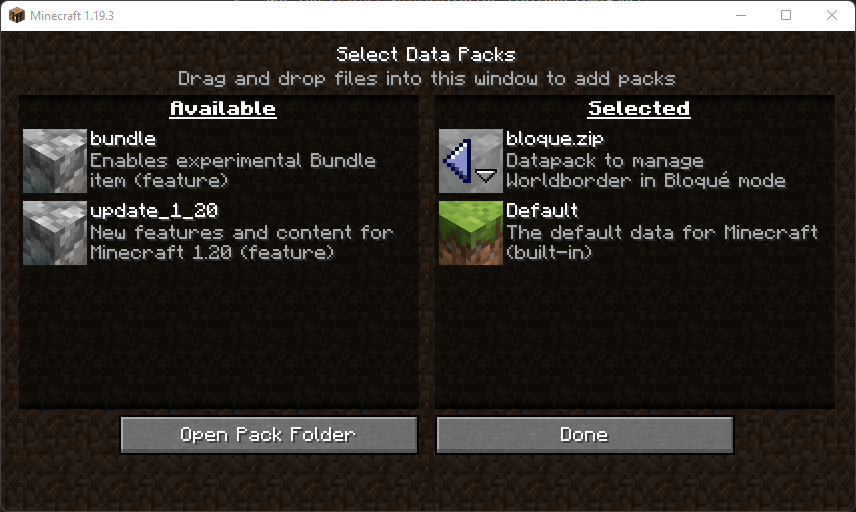

# Bloqué Worlborder

## Installation

Get the [Latest Release](https://github.com/FaustVX/Bloque_WB/releases/latest)
- ### In an existing world
Download `bloqué.zip` and put it in your `.minecraft/saves/<Your Save>/datapacks`

- ### In a new world
    - Click `Datapack` in the `New World` menu
    - Drag&drop `Bloqué.zip` inside the `Select Data Packs` menu
    - Activate the `bloqué.zip` pack



## Usage

At the start of the game run the next command

Replace `x` with the number of steps you want to extend to a full block
- `x` can be any of `1`, `2`, `4`, `5`, `8`, `10`
```
/trigger bloque_init set x
```

Then each time you made an advancement, run
```
/trigger bloque_extend
```
-- or run this to extend multiple times, replace `x` with the correct number (`x` **MUST** be greater or equal to 1) --
```
/trigger bloque_extend set x

## Changelog
### [V2.0 (04/01/2023)](https://github.com/FaustVX/Bloque_WB_MC/releases/tag/v2)
- Allow for custom steps
### [V1.0 (04/01/2023)](https://github.com/FaustVX/Bloque_WB_MC/releases/tag/v1)
- Initial release
